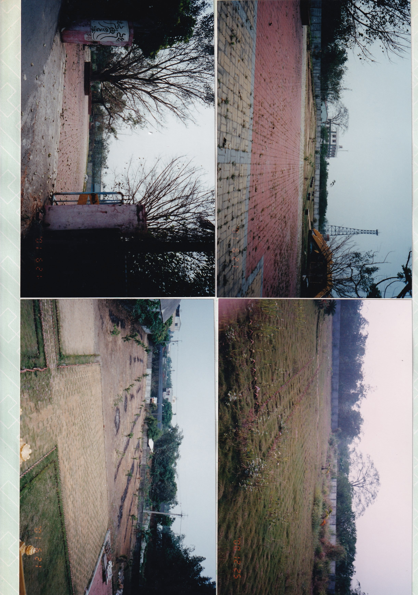
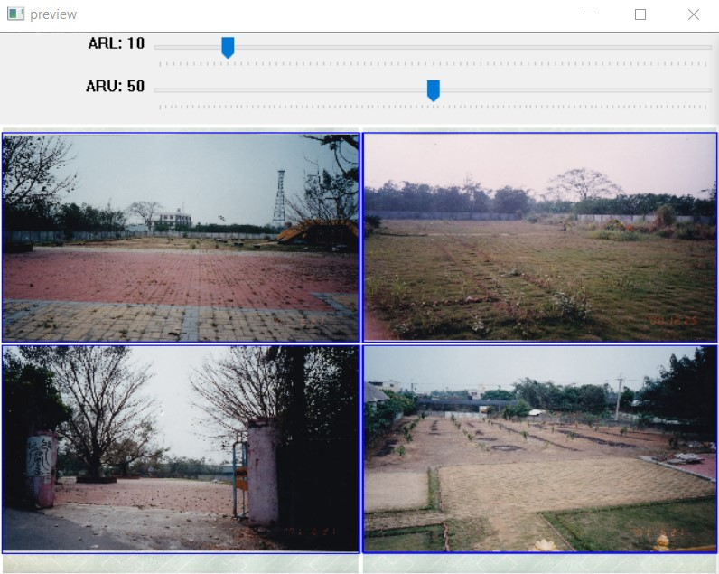

# Extracting Multiple Images from an Image with a White Background using OpenCV




# Install requirement

`pip install opencv-python`

# Usage Instructions

Follow these steps to extract multiple images from an image with a white background:

1. Prepare Your Input Images (jpg)

2. Use the Following Commands:

```

'q': exit 

    'n': next image

    'v': draw vertical line for crop

    'h': draw horizontal line for crop

    'c': crop specific roi

    'r': reset image

    's': save results

    Trackbars:

        ARL: the area ratio low boundary for rectangles tracking

        ARU: the area ratio upper boundary for rectangles tracking

        WThres: White filter threshold

```